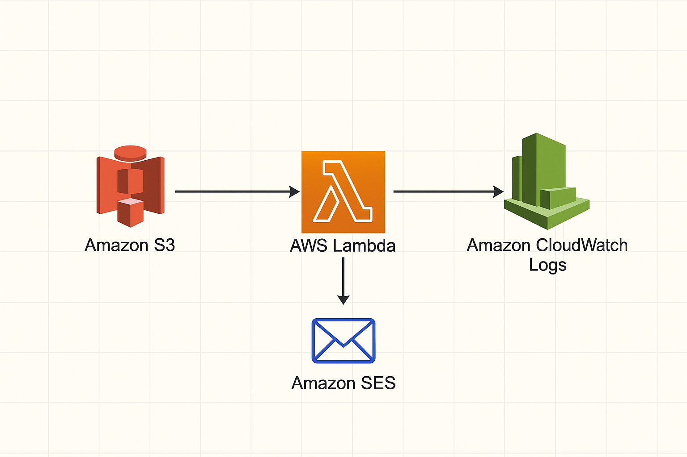
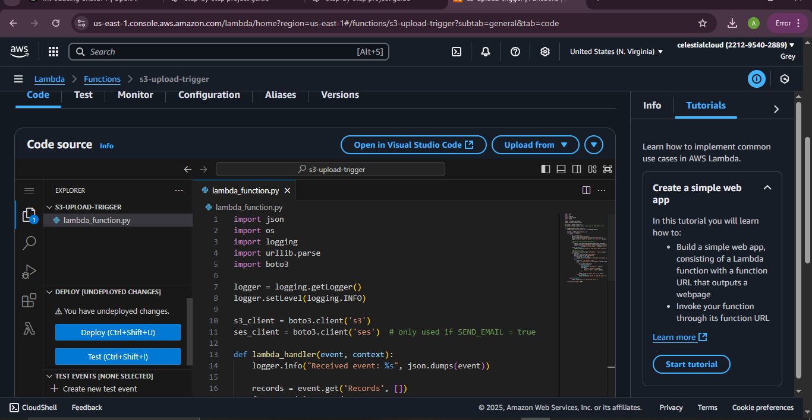
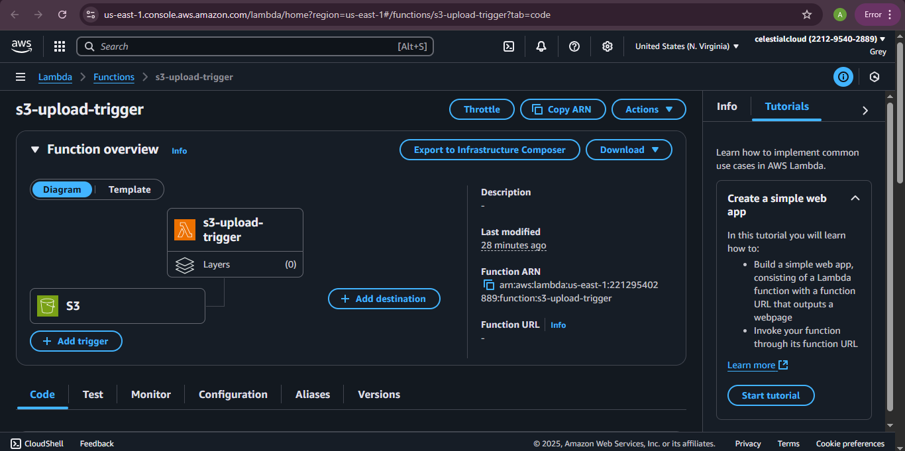
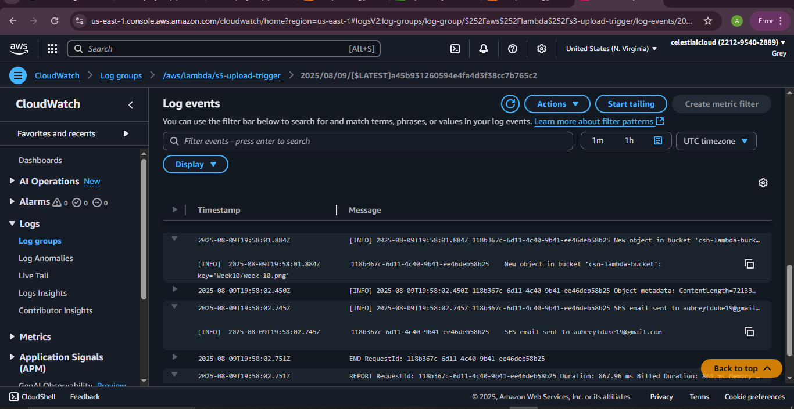

> ### 🔄Lambda Event-Driven Upload Trigger In AWS

**Overview**
This documentation walks you through creating the S3 bucket, creating a Lambda execution role with the required IAM policies, deploying the Lambda (console or CLI), wiring up S3 event notifications and testing everything.


###### Architecture


---

### Project flow

When a file is uploaded to an Amazon S3 bucket, that S3 event triggers an AWS Lambda function. The Lambda function will:
- Log the event (bucket, key, time) to CloudWatch Logs (primary behavior), and
- Optionally read object metadata (`head_object`) and optionally send an email using Amazon SES.

---

### Step-by-step (console + exact CLI commands)

#### 1. 🗑 Create an S3 bucket

**Console**

1. AWS Console → Services → S3 → **Create bucket**.
2. Bucket name: `my-week10-bucket-<your-unique-suffix>` (MUST be globally unique).

---

#### 2.  ⚙️ Create IAM role for Lambda (with CloudWatch, and optional S3/SES permissions)

We will create a role that trusts Lambda and attach the AWS-managed `AWSLambdaBasicExecutionRole` for CloudWatch logging. If Lambda must read objects (`head_object`) or call SES, attach a custom policy with explicit resources.

**Trust policy (Lambda)**

```json
{
  "Version": "2012-10-17",
  "Statement": [
    {
      "Effect": "Allow",
      "Principal": { "Service": "lambda.amazonaws.com" },
      "Action": "sts:AssumeRole"
    }
  ]
}
```

**Console**

1. Console → IAM → Roles → **Create role**.
2. Trusted entity: **AWS service** → **Lambda** → Next.
3. Attach `AWSLambdaBasicExecutionRole`.
4. (Optional) Create and attach a custom policy for S3 read and/or SES send actions (see policy JSONs below).
5. Name the role: `lambda-s3-exec-role-week10`.


  ```

### Add additional IAM policy JSONs to role (Optional)

**S3 read (if Lambda will call)**

```json
{
  "Version": "2012-10-17",
  "Statement": [
    {
      "Sid": "AllowS3ReadForSpecificBucket",
      "Effect": "Allow",
      "Action": ["s3:GetObject","s3:ListBucket","s3:GetObjectAcl"],
      "Resource": [
        "arn:aws:s3:::my-week10-bucket-12345",
        "arn:aws:s3:::my-week10-bucket-12345/*"
      ]
    }
  ]
}
```

**SES send (optional)**

```json
{
  "Version":"2012-10-17",
  "Statement":[
    {
      "Effect":"Allow",
      "Action":["ses:SendEmail","ses:SendRawEmail"],
      "Resource":"*"
    }
  ]
}
```

> Note: SES often requires you to verify the sender identity, and SES accounts may be in sandbox mode (recipient must be verified until you request production access).

---


### 3. Create the Lambda function

Create a function with Python runtime.

**Console**

1. Console → Lambda → **Create function** → Author from scratch.
2. Function name: `s3-upload-trigger-week10`.
3. Runtime: `Python 3.9` (or latest available).
4. Permissions: choose **Use an existing role** → select `lambda-s3-exec-role-week10`.
5. Create function.
6. In **Configuration**: set Timeout 30s, Memory 128MB.
7. Add environment variables (optional):
   - `SEND_EMAIL` = `false`
   - `SES_SOURCE` = `verified-sender@example.com`
   - `SES_DEST` = `verified-recipient@example.com`
8. Paste the Lambda code (see Section 3) into the inline editor and Deploy.
   - This function logs the S3 event, optionally reads object metadata, and optionally sends an SES email when environment variable `SEND_EMAIL=true`.

```python
import json
import os
import logging
import urllib.parse
import boto3

logger = logging.getLogger()
logger.setLevel(logging.INFO)

s3_client = boto3.client('s3')
ses_client = boto3.client('ses')  # only used if SEND_EMAIL = true


def lambda_handler(event, context):
    logger.info("Received event: %s", json.dumps(event))

    records = event.get('Records', [])
    for record in records:
        try:
            s3 = record['s3']
            bucket = s3['bucket']['name']
            key = urllib.parse.unquote_plus(s3['object']['key'])
            logger.info("New object in bucket '%s': key='%s'", bucket, key)

            # Optional: read metadata (head_object)
            try:
                head = s3_client.head_object(Bucket=bucket, Key=key)
                logger.info("Object metadata: ContentLength=%s ContentType=%s",
                            head.get('ContentLength'), head.get('ContentType'))
            except Exception:
                logger.exception("Could not read object head (maybe no permission).")

            # Optional SES email
            send_email = os.environ.get('SEND_EMAIL', 'false').lower() == 'true'
            if send_email:
                source = os.environ.get('SES_SOURCE')
                dest = os.environ.get('SES_DEST')
                if not source or not dest:
                    logger.error("SES_SOURCE or SES_DEST environment variables not set.")
                else:
                    subject = f"New upload: {key}"
                    body = f"A new object was uploaded to {bucket}/{key}."
                    try:
                        ses_client.send_email(
                            Source=source,
                            Destination={'ToAddresses': [dest]},
                            Message={
                                'Subject': {'Data': subject},
                                'Body': {'Text': {'Data': body}}
                            
```


```



---

#### 4. 🔫 Add S3 trigger (two ways)

**Method A — From Lambda console (recommended)**

1. Open your Lambda function → **Add trigger**.
2. Choose **S3**.
3. Bucket: `my-week10-bucket-...`
4. Event type: `All object create events` (or `PUT` only).
5. Prefix / Suffix (optional).
6. Add. Lambda console will auto-add permission so S3 can invoke Lambda.

**Method B — From S3 console**

1. S3 → select bucket → **Properties** → **Event notifications** (or **Events** tab).
2. **Create event notification**: select events `PUT` or `All object create events`, Destination: **Lambda function**, and pick the function.




---

#### 5. 🧪 Test & verify

1. Upload a file to your S3 bucket  `week-10.png`

2. Open CloudWatch Logs → Log groups → `/aws/lambda/s3-upload-trigger` → open the latest log stream.
   - Look for messages like: `New object in bucket 'csn-lambda-bucket': key='week-10.png'`



---

🧠 Conclusion
This project showcases the power of AWS’s serverless ecosystem. By connecting S3, Lambda, and SES, we’ve built a system that reacts instantly to file uploads without needing any servers to manage.

 ---
Read this project on my [Blog](https://greystack.hashnode.dev/automating-file-upload-alerts-with-aws-lambda-s3-ses-and-cloudwatch)

 Feel free to connect or drop feedback on [Aubrey T Dube LinkedIn](https://www.linkedin.com/in/aubrey-t-dube-194896288/) or [GitHub](github.com/greytyler)
