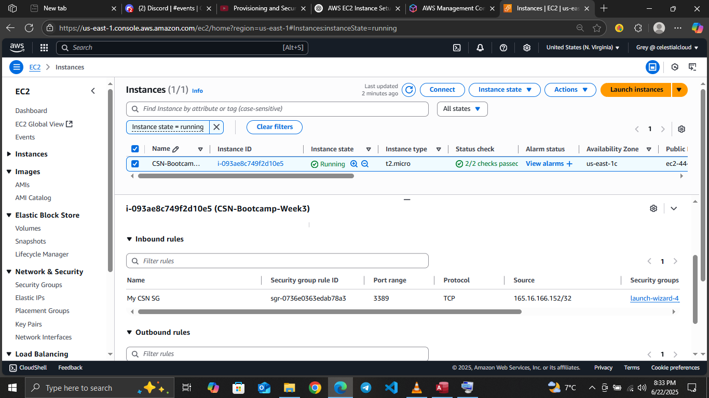
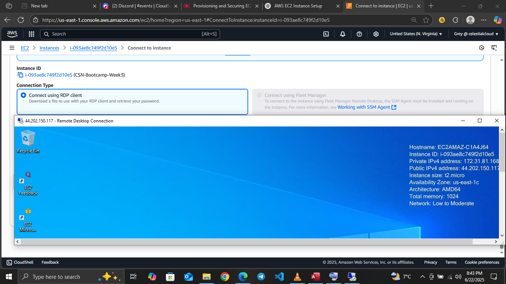

## 🖥️ Launch a Windows Server EC2 Instance

This project demonstrates how to launch a **Microsoft Windows Server 2019** instance on AWS EC2, securely access it using **Remote Desktop Protocol (RDP)**, and ensure proper security and cost control measures are followed — all within the **AWS Free Tier**.

---

#### 🌐 Architecture 

---

## 🚀 Guide

### ✅ 1. Launch EC2 Instance

- Go to AWS [EC2 Dashboard](https://console.aws.amazon.com/ec2)
- Click **“Launch Instance”**
- Configuration:
  - **Name**: `CSN-Bootcamp-Week3`
  - **AMI**: `Microsoft Windows Server 2019 Base`
  - **Instance Type**: `t2.micro` (Free Tier eligible)
  - **Key Pair**: Create new or use existing `.pem` key (must be downloaded and stored securely)

---

### 🌐 2. Network Settings

- **VPC**: Default (or custom public VPC)
- **Subnet**: Public subnet
- **Auto-assign Public IP**: `Enabled`

---

### 🔐 3. Security Group Configuration

Create a new security group with the following inbound rule:

| Type | Protocol | Port | Source |
|------|----------|------|--------|
| RDP  | TCP      | 3389 | My IP  |

This restricts RDP access to your current IP address, ensuring secure remote login.

---

### 🔓 4. Get Windows Administrator Password

1. Go to **EC2 > Instances**
2. Select your instance → Click **Connect**
3. Under **RDP Client**, click **Get Password**
4. Upload your `.pem` key
5. Click **Decrypt Password**
6. Copy the:
   - **Username**: `Administrator`
   - **Password**: (decrypted string)

---

### 🖥️ 5. Connect via RDP

#### 🪟 Windows:
- Open **Remote Desktop Connection** (`mstsc`)
- Paste public IP address from EC2
- Use `Administrator` and decrypted password

#### 🍎 macOS:
- Install **Microsoft Remote Desktop**
- Add new PC → Use public IP and credentials

###### Connection to windows:

---

#### ✅ Conclusion

This task showed how to provision and remotely access a Windows server in the cloud using AWS EC2. You configured proper security via security groups, and used key-based authentication.

By completing this, you've gained real-world experience with:
- Windows Server provisioning
- Remote access setup
- Key management and password decryption

---

🔐 **Cloud Skills Unlocked** | 🧠 **RDP Security Understood** | 🌍 **First Step Toward Real Infrastructure Deployment**

---

#### 🧹 Cleanup:

- ###### Stop (to reuse later): EC2 Console → Select instance → Instance State → Stop
- ###### Terminate (delete forever): EC2 Console → Select instance → Instance State → Terminate

---

###### 🤗 Blog, Experiments & Builds

<a href="https://greystack.hashnode.dev" target="_blank">
  <svg width="220" height="30" viewBox="0 0 260 32" xmlns="http://www.w3.org/2000/svg">
    <defs>
      <!-- Gradient for badge background -->
      <linearGradient id="badgeGrad" x1="0%" y1="0%" x2="100%" y2="100%">
        <stop offset="0%" stop-color="#08627eff" />
        <stop offset="100%" stop-color="#3d056bff" />
      </linearGradient>
      <!-- Path for animated border -->
      <path id="borderPath" d="M8,0 H252 A8,8 0 0 1 260,8 V24 A8,8 0 0 1 252,32 H8 A8,8 0 0 1 0,24 V8 A8,8 0 0 1 8,0 Z" />
      <!-- Gradient for border stroke -->
      <linearGradient id="glowGrad" x1="0%" y1="0%" x2="100%" y2="0%">
        <stop offset="0%" stop-color="#b8f0ffff" />
        <stop offset="100%" stop-color="#6aff45ff" />
      </linearGradient>
    </defs>
    <!-- Gradient background -->
    <rect width="260" height="32" rx="8" fill="url(#badgeGrad)" />
    <!-- Text label -->
    <text x="130" y="21" text-anchor="middle" fill="#ffffff" font-family="Verdana" font-size="14">
      ☁️ Greystack Cloud & Code ⚡
    </text>
    <!-- Animated border stroke -->
    <path d="M8,0 H252 A8,8 0 0 1 260,8 V24 A8,8 0 0 1 252,32 H8 A8,8 0 0 1 0,24 V8 A8,8 0 0 1 8,0 Z"
          fill="none" stroke="url(#glowGrad)" stroke-width="3"
          stroke-dasharray="1000" stroke-dashoffset="0">
      <animate attributeName="stroke-dashoffset" values="1000;0" dur="3s" repeatCount="indefinite" />
    </path>
  </svg>
</a>

###### 📲 Feel free to connect or drop feedback on [Aubrey T Dube LinkedIn](https://www.linkedin.com/in/aubrey-t-dube-194896288/) or [GitHub](https://github.com/greytyler)

