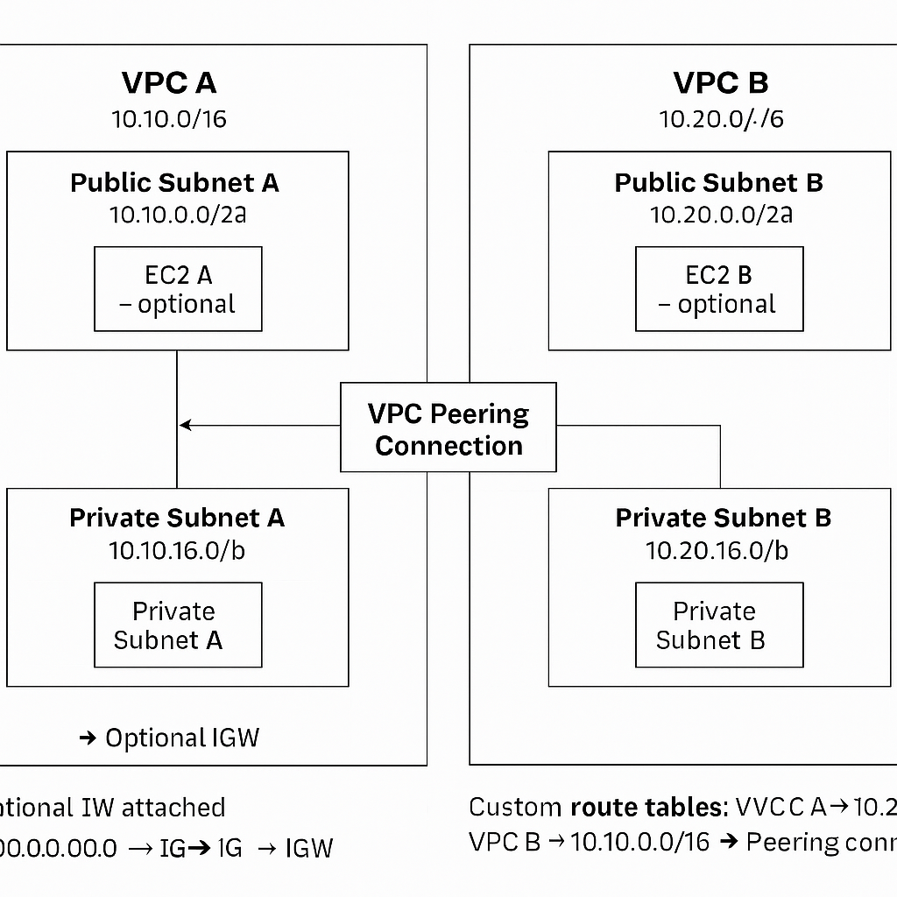
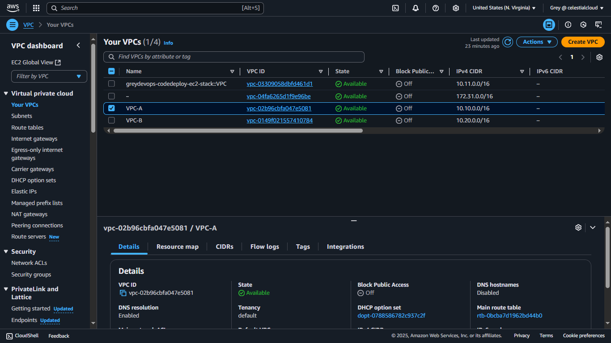
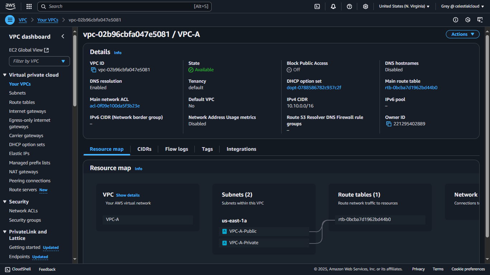
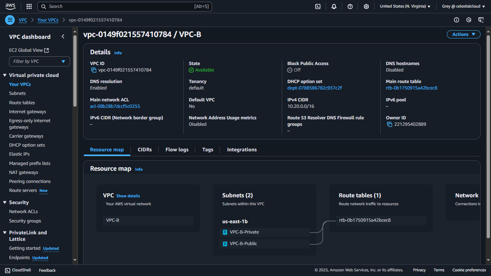
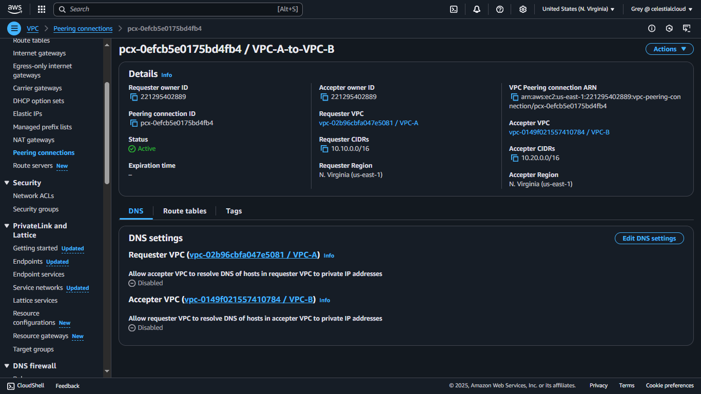
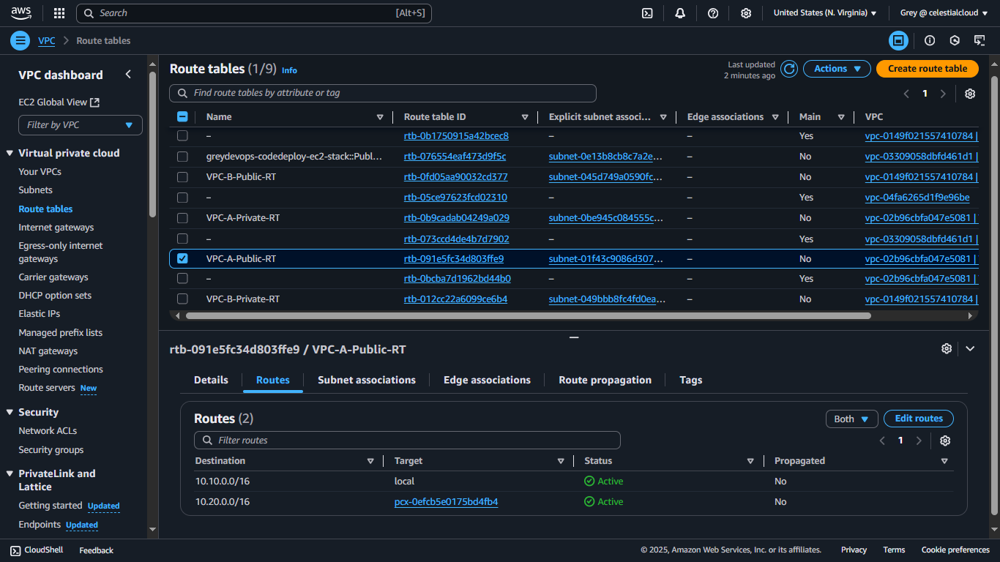

# 🌐 AWS VPC Peering with Public and Private Subnets

This project demonstrates how to set up VPC peering between two Amazon VPCs, each containing a **public** and **private subnet**, and how to enable secure communication between the two VPCs using **AWS Free Tier** resources.

---

## 🗺️ Architecture

---

## 📌 Project Objectives

- Create two VPCs (A & B) with both public and private subnets.
- Establish VPC Peering between the two VPCs.
- Update route tables to allow communication across VPCs.

---

## 🧰 Services Used

- Amazon VPC
- Subnets (Public & Private)
- Route Tables
- VPC Peering
- Internet Gateway (optional)
- EC2 (optional, for testing)

---

## 📐 Network Design

### 🔹 VPC A
- **CIDR**: `10.10.0.0/16`
- **Public Subnet**: `10.10.0.0/20` (e.g. `us-east-1a`)
- **Private Subnet**: `10.10.16.0/20` (e.g. `us-east-1b`)

### 🔹 VPC B
- **CIDR**: `10.20.0.0/16`
- **Public Subnet**: `10.20.0.0/20` (e.g. `us-east-1a`)
- **Private Subnet**: `10.20.16.0/20` (e.g. `us-east-1b`)

💡 Availability Zone (AZ) names like `us-east-1a` are **mapped differently** per account. You can use the same AZ name across VPCs.

---

## 🪜 Step-by-Step Setup

### 1️⃣ Create VPCs

Create VPC A and VPC B from the VPC Dashboard:
- Name each VPC
- Assign CIDR blocks as shown above

---

### 2️⃣ Create Subnets

For each VPC:
- Add **two subnets**:
  - 1 Public
  - 1 Private
- Choose appropriate AZs (can be reused between VPCs)

  
  

---

### 3️⃣ Create Internet Gateway (optional)

To allow internet access from public subnets:
- Create an **Internet Gateway**
- Attach it to VPC A
- Update VPC A's public subnet route table:
  - `0.0.0.0/0` → Internet Gateway

---

### 4️⃣ Create VPC Peering Connection

1. Go to **VPC > Peering Connections**
2. Click **Create Peering Connection**
3. Set:
   - **Requester VPC**: VPC A
   - **Accepter VPC**: VPC B
4. Accept the peering request
5. Wait until status is `Active`

---

### 5️⃣ Update Route Tables

Update route tables for all subnets in **both VPCs**:

#### VPC A Routes:
- **Destination**: `10.20.0.0/16` → Target: Peering Connection ID

#### VPC B Routes:
- **Destination**: `10.10.0.0/16` → Target: Peering Connection ID

✅ Add these entries to both **public** and **private** subnets in each VPC.

---

### 6️⃣ (Optional) Launch EC2 Instances

To test cross-VPC connectivity:
- Launch EC2 in VPC A Public Subnet
- Launch EC2 in VPC B Private Subnet
- Allow ICMP or SSH in security groups for testing

---

## 🧹 Clean-Up Instructions

To avoid charges:

1. **Terminate EC2 instances** (if any)
2. **Release Elastic IPs** (if allocated)
3. **Delete VPC Peering Connection**
4. **Delete custom route entries** from all subnets
5. **Delete subnets**
6. **Delete Internet Gateway** (if created)
7. **Delete VPCs**

---

## 🧾 References

- [AWS VPC Peering Documentation](https://docs.aws.amazon.com/vpc/latest/peering/what-is-vpc-peering.html)
- [AWS Free Tier Info](https://aws.amazon.com/free)

---

## 🏁 Conclusion

This project covered building two isolated VPCs with structured public and private subnets and securely connecting them using **VPC Peering**. 

---
