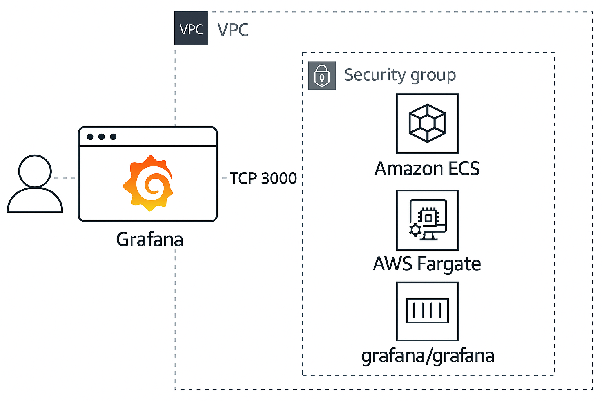
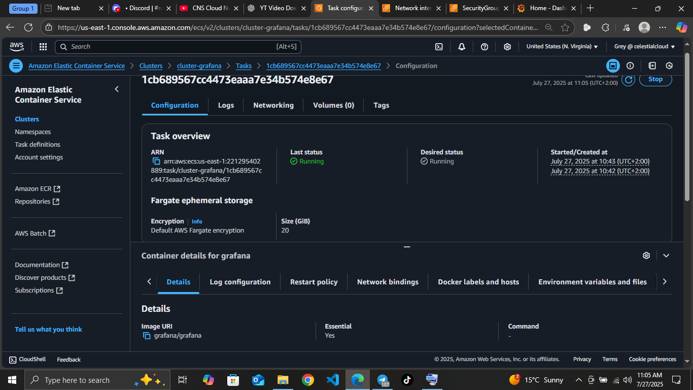
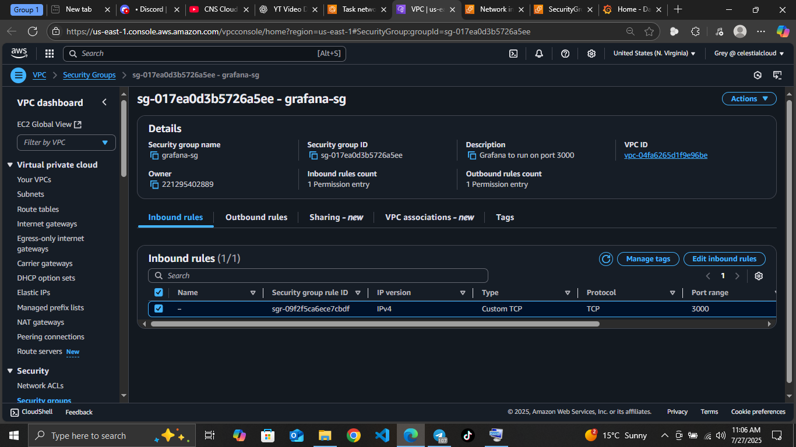
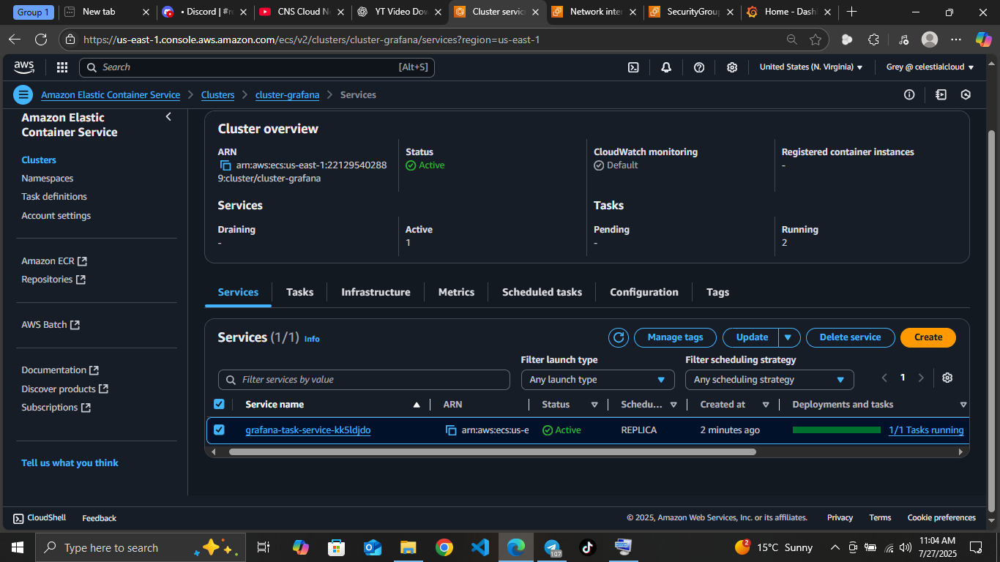
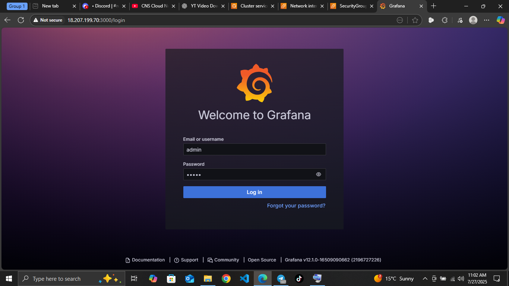
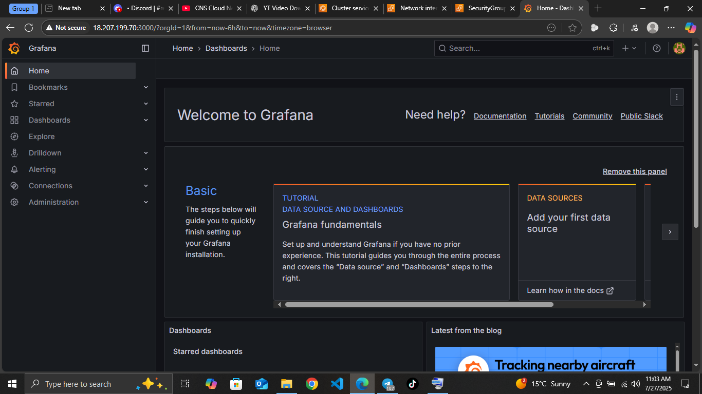

> ## 🚀 Deploying Grafana on ECS with Fargate

#### Architecture

--- 

#### 📌 Objective
Deploy Grafana using Amazon ECS with Fargate. Grafana will run in a public subnet and be accessible via port 3000 using a Docker image from grafana/grafana.

#### 🛠️ Prerequisites
Before you begin:

AWS account with administrative access

VPC with public subnets

An IAM role with ECS permissions

AWS CLI and ECS CLI configured

Familiarity with ECS Fargate and Docker

#### 🔧 Procedure 

##### 1. Create ECS Cluster
Go to the ECS console:
 - Choose Clusters > Create Cluster
 - Select Networking only (Fargate)
 - Cluster name: `grafana-cluster`
 - Click Create

##### 2. Define Task Definition
Go to Task Definitions > Create new Task Definition:
- Launch type: `Fargate`
- Task Definition Name: `grafana-task`
- Task Role: Leave default unless using IAM features
- Network Mode: `awsvpc`
**Container Definitions:**
- Click Add container
- Container name: `grafana`
- Image: `grafana/grafana:latest`
**Port mappings:**
- Container port: `3000`
- Protocol: `tcp`
- Memory Limits: `512 MiB`
- CPU Units: `256`
- Click Add then Create Task Definition

##### 3. Create Security Group
Go to EC2 > Security Groups:
-Name: `grafana-sg`

**Inbound rule:**
- Type: `Custom TCP`
- Port range: `3000`
- Source: `0.0.0.0/0`

This allows public access on port 3000.

##### 4. Run ECS Service
Back in ECS Console:
- Go to Clusters > grafana-cluster
- Click Create in the Services tab
**Service Configuration:**
- Launch type: `Fargate`
- Task definition: `grafana-task`
- Service name: `grafana-service`
- Number of tasks: `1`
**Networking:**
VPC: Select existing
Subnets: Select public subnet(s)
Security groups: Select `grafana-sg`
Enable auto-assign public IP
Click `Create Service`

##### 5. Get Public IP
After the service is running:
- Go to Tasks tab
- Click the running task
- Under ENI (Elastic Network Interface) section, note the Public IP address

##### 6. Access Grafana UI
Open your browser and navigate to: **http://<.PUBLIC-IP>:3000**
Use default credentials:
Username: admin
Password: admin

  
  

##### ✅ Conclusion
Grafana is now successfully deployed on AWS Fargate via ECS, accessible on port 3000 with no servers to manage. Simple, scalable, and ready for monitoring.

---

###### 🧹 Cleanup
- ✅ 1. Stop the Running Task
- ✅ 2. Delete the ECS Cluster
- ✅ 3. Deregister the Task Definition
- ✅ 4. Delete the Security Group (Optional)
- ✅ 5. Clean Up IAM Role: `ecsTaskExecutionRole`

---
###### 🤗 Code, coffee, and cloud chaos ☕☁️

<a href="https://greystack.hashnode.dev" target="_blank">
  <svg width="220" height="30" viewBox="0 0 260 32" xmlns="http://www.w3.org/2000/svg">
    <defs>
      <!-- Gradient for badge background -->
      <linearGradient id="badgeGrad" x1="0%" y1="0%" x2="100%" y2="100%">
        <stop offset="0%" stop-color="#08627eff" />
        <stop offset="100%" stop-color="#3d056bff" />
      </linearGradient>
      <!-- Path for animated border -->
      <path id="borderPath" d="M8,0 H252 A8,8 0 0 1 260,8 V24 A8,8 0 0 1 252,32 H8 A8,8 0 0 1 0,24 V8 A8,8 0 0 1 8,0 Z" />
      <!-- Gradient for border stroke -->
      <linearGradient id="glowGrad" x1="0%" y1="0%" x2="100%" y2="0%">
        <stop offset="0%" stop-color="#b8f0ffff" />
        <stop offset="100%" stop-color="#6aff45ff" />
      </linearGradient>
    </defs>
    <!-- Gradient background -->
    <rect width="260" height="32" rx="8" fill="url(#badgeGrad)" />
    <!-- Text label -->
    <text x="130" y="21" text-anchor="middle" fill="#ffffff" font-family="Verdana" font-size="14">
      ☁️ Cool Cloud tech Articles ⚡
    </text>
    <!-- Animated border stroke -->
    <path d="M8,0 H252 A8,8 0 0 1 260,8 V24 A8,8 0 0 1 252,32 H8 A8,8 0 0 1 0,24 V8 A8,8 0 0 1 8,0 Z"
          fill="none" stroke="url(#glowGrad)" stroke-width="3"
          stroke-dasharray="1000" stroke-dashoffset="0">
      <animate attributeName="stroke-dashoffset" values="1000;0" dur="3s" repeatCount="indefinite" />
    </path>
  </svg>
</a>

###### 📲 Feel free to connect or drop feedback on [Aubrey T Dube LinkedIn](https://www.linkedin.com/in/aubrey-t-dube-194896288/) or [GitHub](https://github.com/greytyler)
