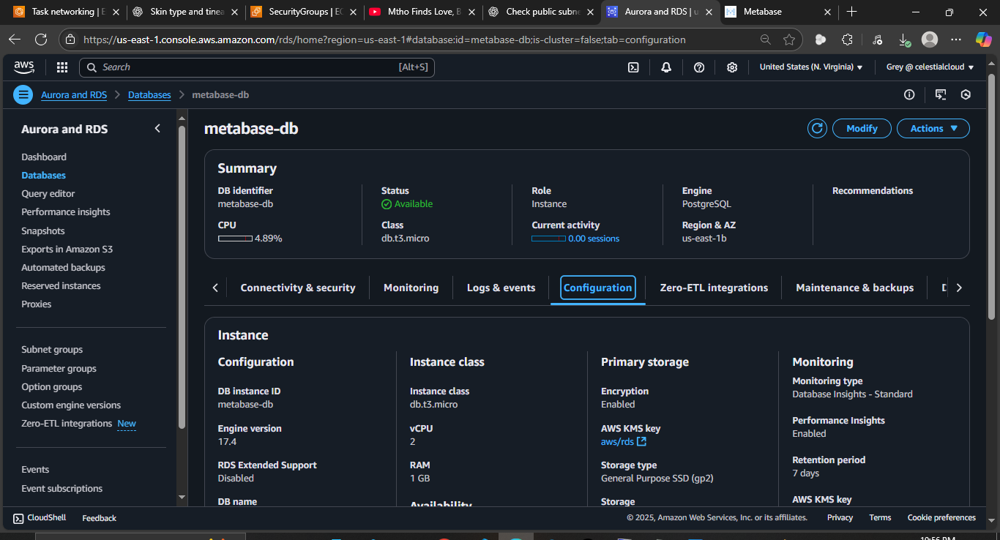
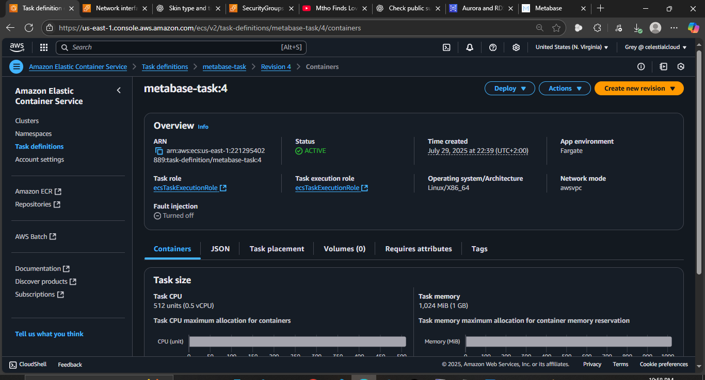
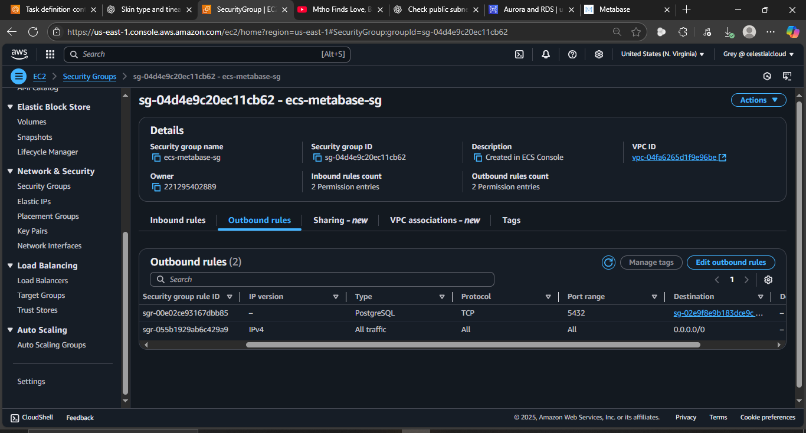
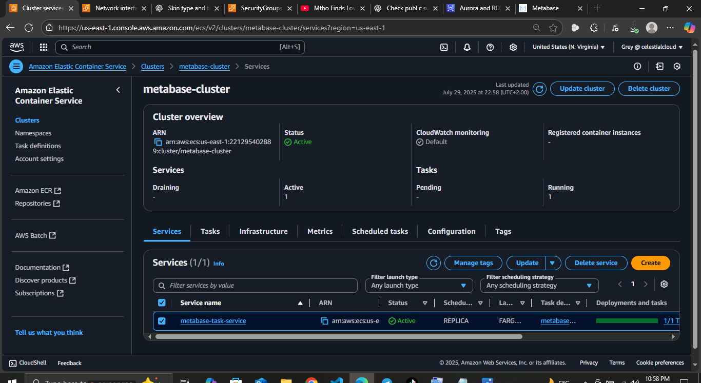
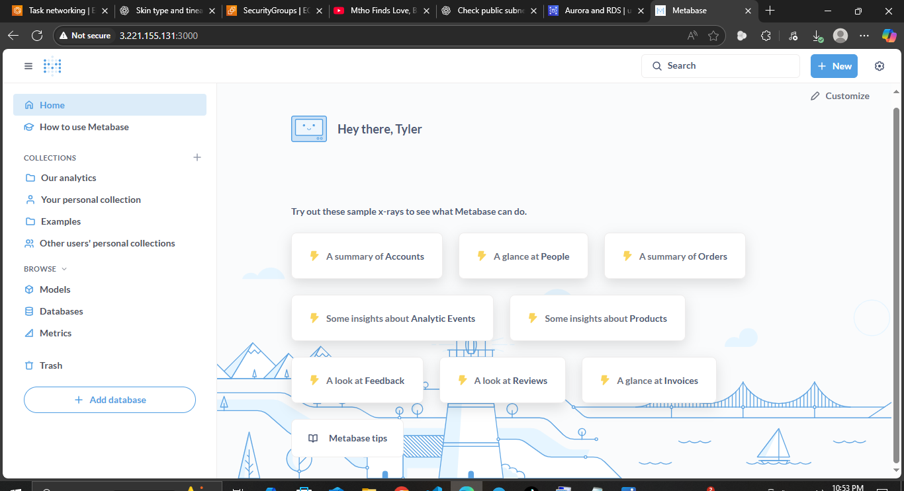

##  Deploy Metabase on Amazon ECS Fargate with PostgreSQL RDS

#### Overview

This project involves deploying Metabase, an open-source business intelligence tool, on Amazon ECS using Fargate, and connecting it to a PostgreSQL database hosted on Amazon RDS. The goal is to set up a containerized application within a secure VPC environment and enable database connectivity, all while staying within AWS Free Tier limits.

---

### Objectives

* Deploy Metabase as a containerized app on ECS Fargate.
* Launch a PostgreSQL database on Amazon RDS.
* Configure secure communication between Metabase and the database.
* Ensure all configurations are AWS Free Tier eligible.
* Provide screenshots and perform a clean teardown of resources.

---

## Architecture Diagram

```
                      +----------------------+
                      |   Metabase (Docker)  |
                      |     ECS + Fargate    |
                      |  (in Private Subnet) |
                      +----------+-----------+
                                 |
                                 | port 5432
                                 v
                      +----------------------+
                      |  PostgreSQL (Amazon) |
                      |      RDS DB          |
                      |  (in Private Subnet) |
                      +----------------------+
                                 |
                        In same VPC + Security Group
```

---

### Phase 1: RDS PostgreSQL Setup (Free Tier)

#### Step 1: Launch Amazon RDS Instance

* **Engine:** PostgreSQL
* **DB Instance Class:** db.t3.micro (Free Tier eligible)
* **Storage:** 20 GB, General Purpose SSD
* **Public Access:** No
* **Database Name:** metabase
* **Master Username/Password:** Created and saved securely



#### Step 2: VPC & Security Configuration

* **VPC:** Default or custom VPC
* **Subnet Group:** Default
* **Security Group:** Created named `rds-sg`

  * **Inbound rule:** PostgreSQL (TCP port 5432) — to be updated later for ECS traffic

#### Step 3: Save Connection Details

* Saved the **endpoint**, **port (5432)**, **DB name**, **username**, and **password** for use in ECS Metabase setup.

---

### Phase 2: ECS Task and Cluster Setup

#### Step 1: Create ECS Cluster
* **Type:** Networking only (Fargate)
* **Name:** `metabase-cluster`

#### Step 2: Create Task Definition

* **Launch Type:** Fargate
* **Task Role:** Basic ECS role with default permissions
* **Container Name:** `metabase`
* **Image:** `metabase/metabase`
* **Port Mapping:** 3000



#### Environment Variables:

```
MB_DB_TYPE=postgres
MB_DB_DBNAME=metabase
MB_DB_PORT=5432
MB_DB_USER=admin
MB_DB_PASS=<your-password>
MB_DB_HOST=<your-rds-endpoint>
```

#### Step 3: Security Group for ECS

* Created ECS task security group `ecs-sg`
* Updated `rds-sg` to allow inbound traffic on port 5432 from `ecs-sg`


#### Step 4: Run ECS Task (via service)
* Go to ECS > Clusters, select your cluster, then “Create” under Services.

* Choose your Task Definition, set launch type to Fargate, and configure 1 task with the appropriate subnets and security group.
###### I have:
* Launched the Metabase task in the same VPC and subnet as RDS.
* Task used the created `ecs-sg` security group.
* Confirmed Metabase was accessible on port 3000 via public IP.


---

### Phase 3: Metabase Setup Screen

* Accessed Metabase via `http://<public-ip>:3000`
* Walked through initial Metabase setup:

  * Set up organization
  * Entered PostgreSQL connection details
  * Successfully connected to the RDS database


---

## Cleanup Process

### ECS Cleanup

* Stopped and deleted running tasks
* Deleted ECS service (if created)
* Deregistered and deleted task definition
* Deleted ECS cluster


## Conclusion

This project demonstrated how to deploy a data visualization tool using containerized infrastructure on AWS. By utilizing ECS Fargate and RDS within the Free Tier limits, we ensured efficient and cost-effective deployment.


--- 

##### 🧹 Full Cleanup Guide:
- ✅ 1: Stop and Delete the ECS Task
- ✅ 2: Delete the ECS Service (if you created one)
- ✅ 3: Delete the ECS Cluster
- ✅ 4: Deregister and delete the Task Definition
- ✅ 5: Delete the Security Groups
- ✅ 6: Delete the RDS Database
- ✅ 7: Delete Unused VPC Resources (Optional)