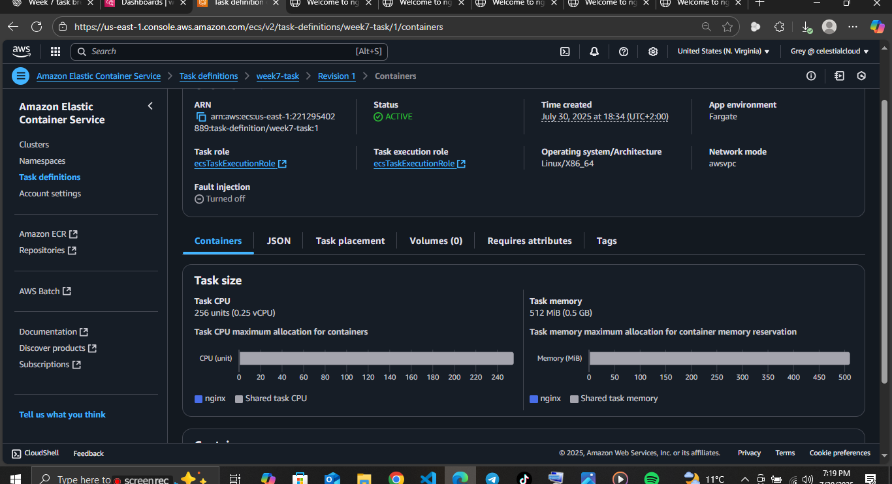
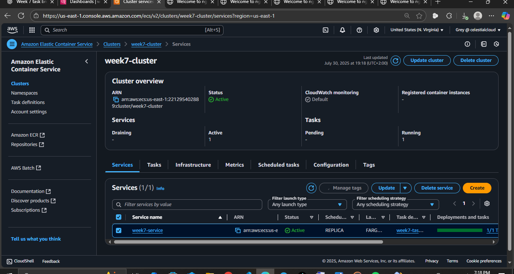
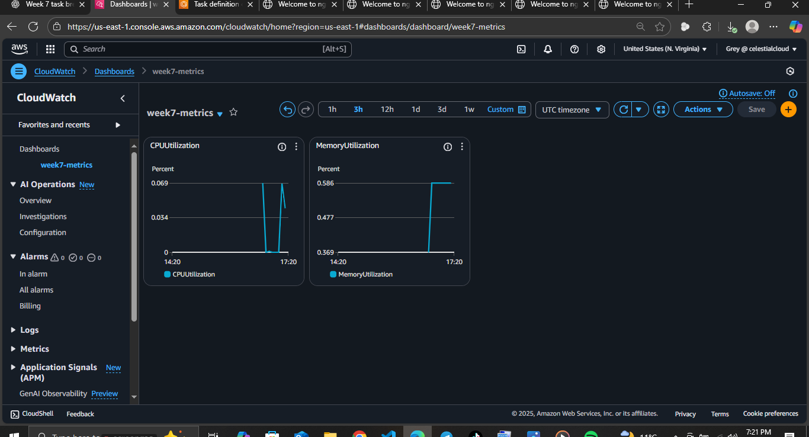
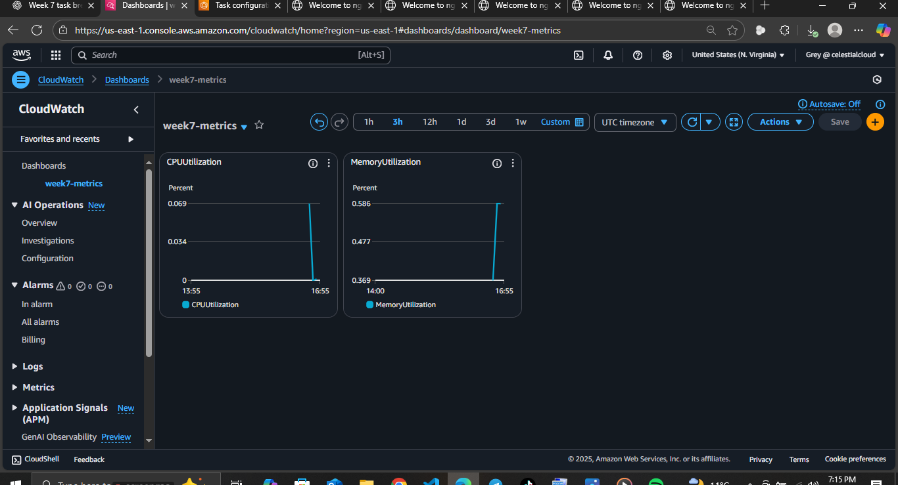

> ### 🧱 ECS Fargate + CloudWatch Monitoring

######  Deploy a containerized app **(NGINX or Grafana)** on **Amazon ECS** using **Fargate**, and monitor CPU/Memory utilization using a **CloudWatch** Dashboard.

<br>

##### Architecture
```
[User's Browser]
       |
       v
[Public Internet]
       |
       v
[AWS VPC]
 ├── [Public Subnet]
 │     ├── [Fargate Task: NGINX/Grafana]
 │     │       └─ CPU + Memory Allocation
 │     └── [Security Group: HTTP (80) / Custom Port]
 |
 └── [CloudWatch Dashboard]
         ├── CPUUtilization Widget
         └── MemoryUtilization Widget
```

##### 📍 Steps Taken

##### 1. ECS Cluster Created
- Cluster Name: week7-cluster
- Launch type: Fargate


##### 2. Task Definition
- Task Name: week7-task
- CPU: 256 (.25 vCPU)
- Memory: 512 MiB
- Container: nginx or grafana/grafana
- Port: 80 or 3000



##### 3. ECS Service Deployment
- Service Name: week7-service
- Subnet: Public
- Auto-assign Public IP: Enabled
- Security Group: Allows port 80 or 3000



##### 4. CloudWatch Dashboard
- Dashboard: week7-metrics
- Widgets Added:
- CPUUtilization
- MemoryUtilization



##### 5. Simulated Load
- Action: Auto-refresh browser on public IP to create metric activity


## 🧼 Clean-Up Instructions

To stay within the Free Tier:

- ✅ 1. Delete the ECS Service
- ✅ 2. Delete the Running Task (if any)
- ✅ 3. Delete the ECS Cluster distribution
- ✅ 4. Deregister the Task Definition
- ✅ 5. Delete the CloudWatch Dashboard


--- 
###### 🤗 My blog’s got more diagrams than a conspiracy theorist’s basement

<a href="https://greystack.hashnode.dev" target="_blank">
  <svg width="220" height="30" viewBox="0 0 260 32" xmlns="http://www.w3.org/2000/svg">
    <defs>
      <!-- Gradient for badge background -->
      <linearGradient id="badgeGrad" x1="0%" y1="0%" x2="100%" y2="100%">
        <stop offset="0%" stop-color="#08627eff" />
        <stop offset="100%" stop-color="#3d056bff" />
      </linearGradient>
      <!-- Path for animated border -->
      <path id="borderPath" d="M8,0 H252 A8,8 0 0 1 260,8 V24 A8,8 0 0 1 252,32 H8 A8,8 0 0 1 0,24 V8 A8,8 0 0 1 8,0 Z" />
      <!-- Gradient for border stroke -->
      <linearGradient id="glowGrad" x1="0%" y1="0%" x2="100%" y2="0%">
        <stop offset="0%" stop-color="#b8f0ffff" />
        <stop offset="100%" stop-color="#6aff45ff" />
      </linearGradient>
    </defs>
    <!-- Gradient background -->
    <rect width="260" height="32" rx="8" fill="url(#badgeGrad)" />
    <!-- Text label -->
    <text x="130" y="21" text-anchor="middle" fill="#ffffff" font-family="Verdana" font-size="14">
      ☁️ greystack - code, cloud, AI⚡
    </text>
    <!-- Animated border stroke -->
    <path d="M8,0 H252 A8,8 0 0 1 260,8 V24 A8,8 0 0 1 252,32 H8 A8,8 0 0 1 0,24 V8 A8,8 0 0 1 8,0 Z"
          fill="none" stroke="url(#glowGrad)" stroke-width="3"
          stroke-dasharray="1000" stroke-dashoffset="0">
      <animate attributeName="stroke-dashoffset" values="1000;0" dur="3s" repeatCount="indefinite" />
    </path>
  </svg>
</a>


###### 📲 Feel free to connect or drop feedback on [Aubrey T Dube LinkedIn](https://www.linkedin.com/in/aubrey-t-dube-194896288/) or [GitHub](https://github.com/greytyler)


