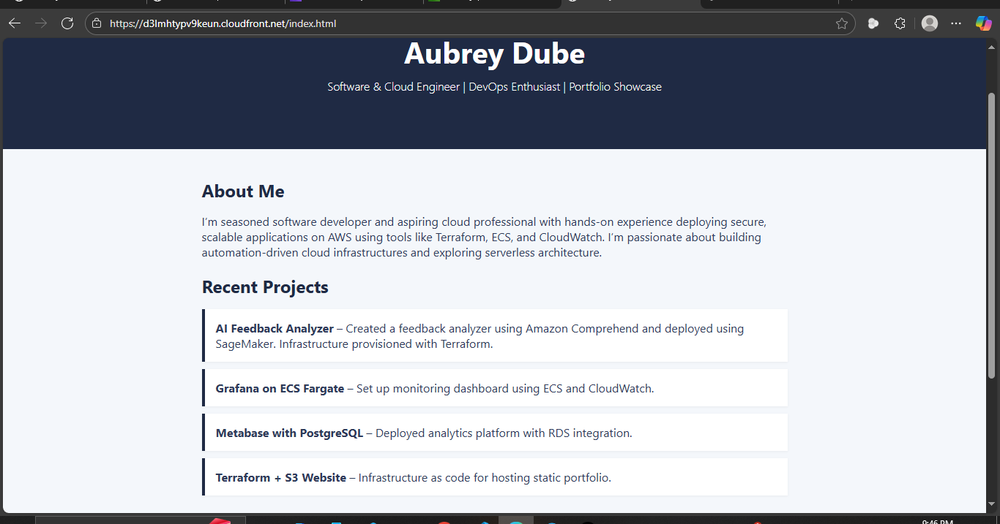
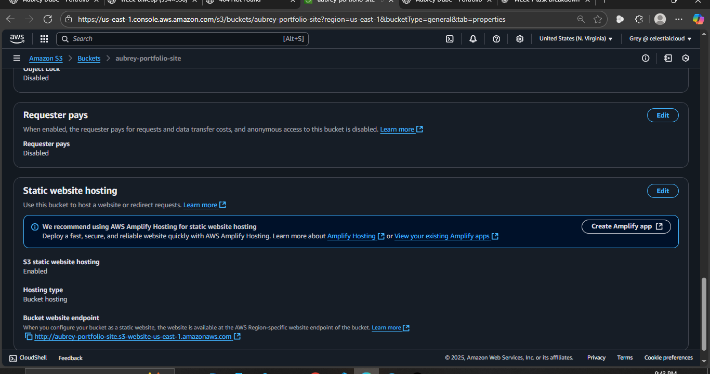
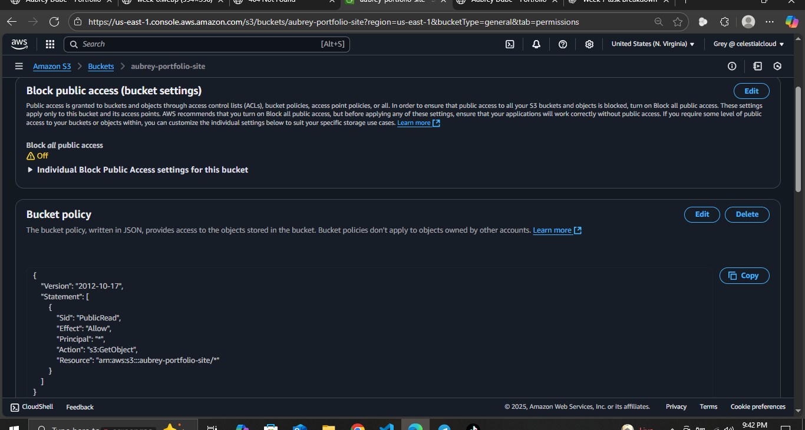
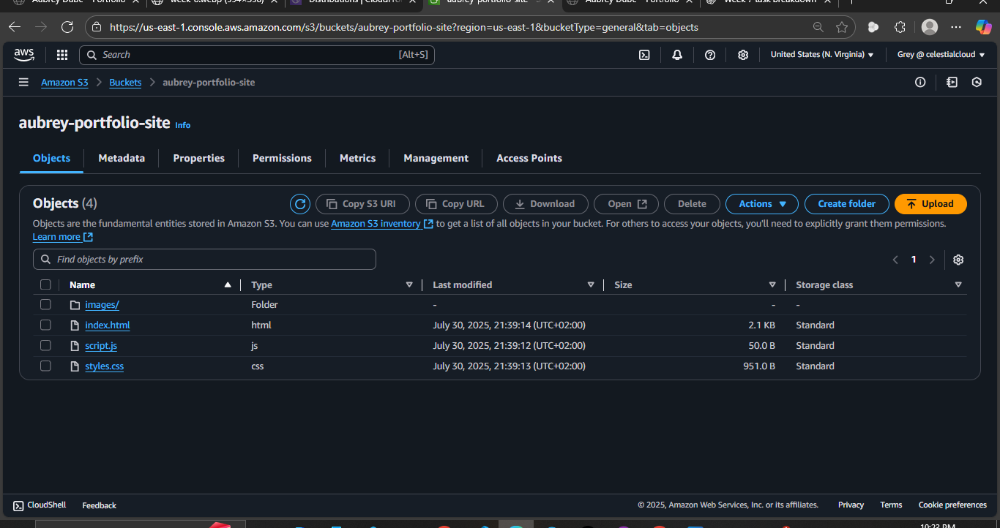
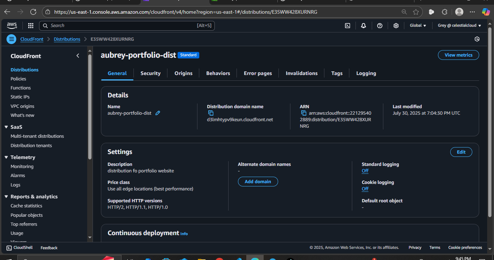

# 🌐 Personal Portfolio Website — AWS S3 + CloudFront

This project showcases a **simple, responsive, and minimalistic portfolio website** hosted on **Amazon S3** and delivered globally using **AWS CloudFront distribution**.

> ✅ Built within AWS Free Tier limits

---

#### 🚀 Live URL (via CloudFront)

[https://your-cloudfront-url.cloudfront.net](#)

<div align="left">

</div>

---

### 📁 Features

- Responsive navy blue, grey, and white layout using pure HTML/CSS/JS
- Deployed securely using AWS services

---

### 🛠️ Tech Stack

- **Frontend**: HTML5, CSS3, Vanilla JavaScript
- **Cloud**: Amazon S3 (hosting), AWS CloudFront (CDN + HTTPS)

---

### 🧱 Architecture

```text
[Local HTML/CSS/JS Files]
        |
        v
[AWS S3 Bucket with Static Website Hosting]
        |
        v
[CloudFront Distribution (HTTPS)]

```

### 📦 Folder Structure

```
📁 images/
📄 index.html
📄 styles.css
📄 script.js
```

---

### 🧪 Deployment Steps

#### 1. S3 Bucket Setup

- Created bucket with a unique name
- Enabled "Static website hosting"
- Uploaded `index.html`, CSS, JS, and assets to the **bucket root** (not a folder)
- Configured public read access with a bucket policy

<br>

**S3 static hosting settings**

<p float="left">
  
  
</p>

**Uploaded file structure in S3**

<div align="left">
  
</div>

---

### 2. CloudFront Distribution

- Linked S3 static website endpoint as origin
- Set viewer protocol to **redirect HTTP to HTTPS**
- Created distribution and waited for deployment

**CloudFront distribution settings**

<div align="left">
  
</div>

**CloudFront domain in browser**

<div align="left">
  
</div>

---

## 🧼 Clean-Up Instructions

To stay within the Free Tier:

- ❌ Delete all objects from S3
- ❌ Delete the S3 bucket
- ❌ Delete the CloudFront distribution

--- 
###### 🤗 Blog, experiments & builds

<a href="https://greystack.hashnode.dev" target="_blank">
  <svg width="220" height="30" viewBox="0 0 260 32" xmlns="http://www.w3.org/2000/svg">
    <defs>
      <!-- Gradient for badge background -->
      <linearGradient id="badgeGrad" x1="0%" y1="0%" x2="100%" y2="100%">
        <stop offset="0%" stop-color="#08627eff" />
        <stop offset="100%" stop-color="#3d056bff" />
      </linearGradient>
      <!-- Path for animated border -->
      <path id="borderPath" d="M8,0 H252 A8,8 0 0 1 260,8 V24 A8,8 0 0 1 252,32 H8 A8,8 0 0 1 0,24 V8 A8,8 0 0 1 8,0 Z" />
      <!-- Gradient for border stroke -->
      <linearGradient id="glowGrad" x1="0%" y1="0%" x2="100%" y2="0%">
        <stop offset="0%" stop-color="#b8f0ffff" />
        <stop offset="100%" stop-color="#6aff45ff" />
      </linearGradient>
    </defs>
    <!-- Gradient background -->
    <rect width="260" height="32" rx="8" fill="url(#badgeGrad)" />
    <!-- Text label -->
    <text x="130" y="21" text-anchor="middle" fill="#ffffff" font-family="Verdana" font-size="14">
      ☁️ greystack - code, cloud, AI⚡
    </text>
    <!-- Animated border stroke -->
    <path d="M8,0 H252 A8,8 0 0 1 260,8 V24 A8,8 0 0 1 252,32 H8 A8,8 0 0 1 0,24 V8 A8,8 0 0 1 8,0 Z"
          fill="none" stroke="url(#glowGrad)" stroke-width="3"
          stroke-dasharray="1000" stroke-dashoffset="0">
      <animate attributeName="stroke-dashoffset" values="1000;0" dur="3s" repeatCount="indefinite" />
    </path>
  </svg>
</a>


###### 📲 Feel free to connect or drop feedback on [Aubrey T Dube LinkedIn](https://www.linkedin.com/in/aubrey-t-dube-194896288/) or [GitHub](https://github.com/greytyler)


---

##### 📝 License

MIT License — feel free to use the template.
