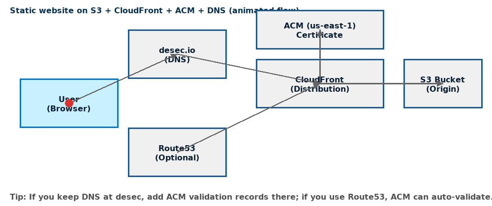
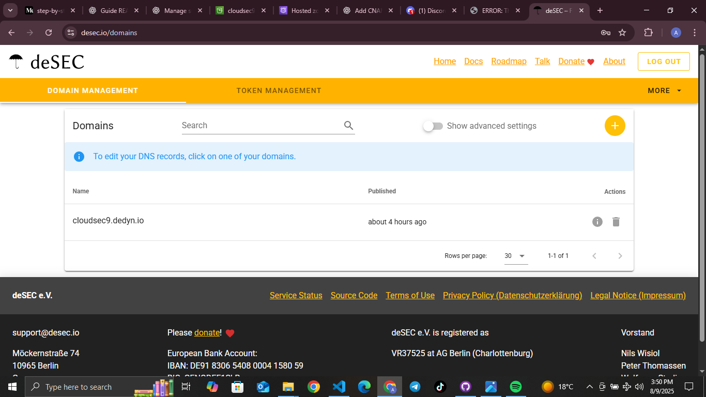
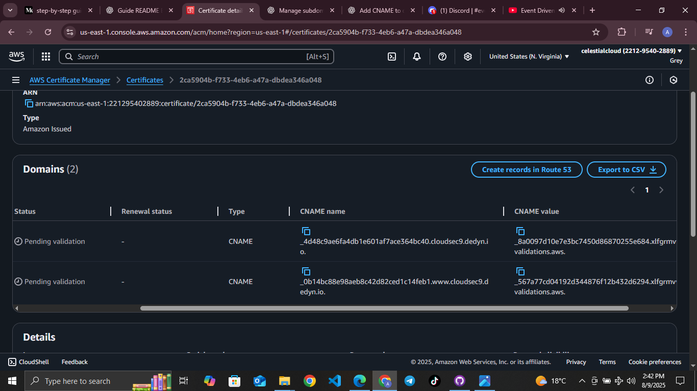
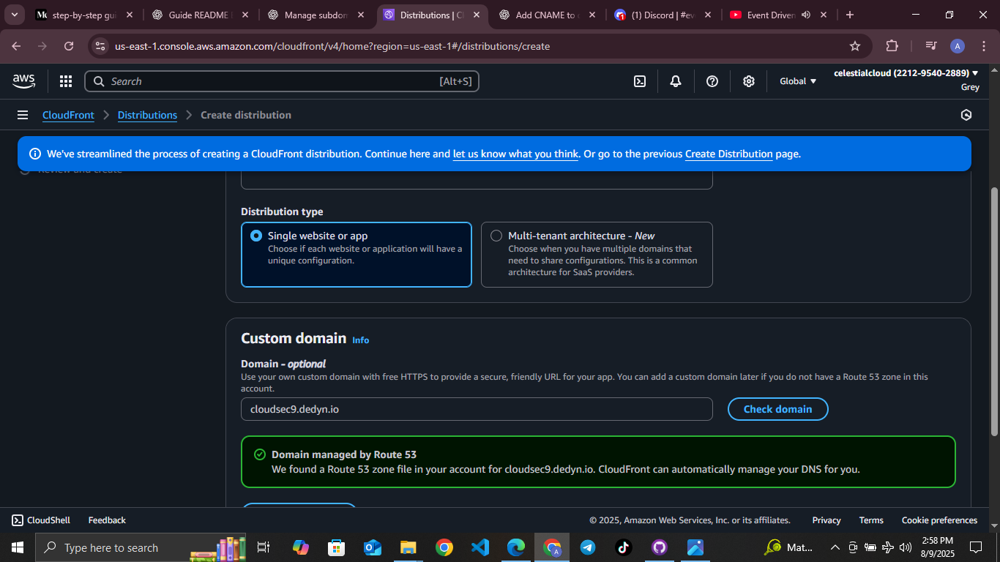
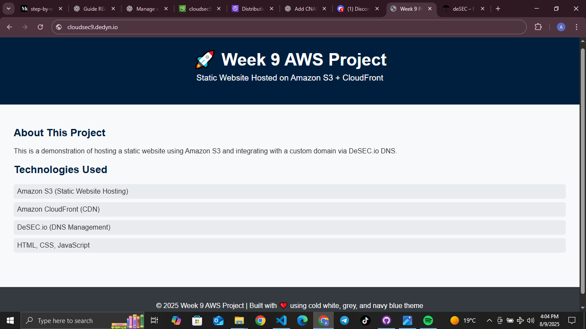

---

> ## CSN9 🌐Domain and SSL Setup Using AWS with desec.io Domain & Static Site Write-up
---

###### Architectural flow

----

### 1. Domain Registration

* Registered a **free domain on desec.io**, which provides DNS management.
* This allowed control over DNS settings essential for ACM validation and hosting.
* *Alternatively*, simulated registration with placeholder domain `mydemo.tk` to illustrate the registration workflow.

### 2. DNS Setup (Route 53 / desec.io)

* For the real desec.io domain:

  * Managed DNS records directly on desec.io’s dashboard.
  * Added ACM-required CNAME records (noting some UI restrictions on underscores).
* For simulation:

  * Created a Route 53 hosted zone for `mydemo.tk`.
  * Added mock NS and A records to simulate delegation and hosting.
* ###### Route 53 hosted zone or desec.io DNS dashboard showing records.

  
  

### 3. SSL Certificate Request (ACM)

* Requested a public certificate for the domain via AWS Certificate Manager using DNS validation.
* Added the ACM-provided CNAME validation records in DNS (desec.io or Route 53).
* Certificate status shown as **Pending Validation** or validated if possible.
* ###### ACM console showing the certificate request and validation status.
 

### 4. CloudFront Distribution and Static Site Hosting

* Hosted a static website in an S3 bucket configured for static site hosting.
* Created a CloudFront distribution with:

  * The domain as Alternate Domain Name (CNAME).
  * The validated ACM SSL certificate attached.
  * The S3 bucket as origin.
* ###### CloudFront distribution settings showing custom domain and SSL cert.
 

### 5. HTTPS Website Access (Simulated or Real)

* ###### Website browsing `https://cloudsec9.dedyn.io` 

###### Expected Secure Connection Behavior After Validation:
Once the SSL certificate is successfully validated and attached to the CloudFront distribution, visitors accessing the website via the custom domain will see the site load over HTTPS with a secure padlock icon in their browser. This ensures encrypted communication, verifies the site’s authenticity, and builds user trust.

---

