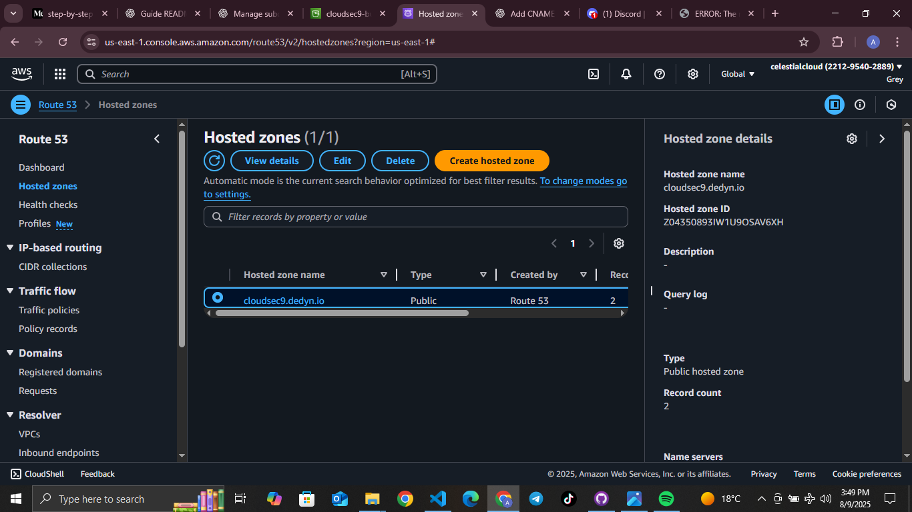

---

> ## CSN9 🌐Domain and SSL Setup Using AWS with desec.io Domain & Static Site Write-up
---

###### Architectural flow

----

### 1. Domain Registration

* Registered a **free domain on desec.io**, which provides DNS management.
* This allowed control over DNS settings essential for ACM validation and hosting.
* *Alternatively*, simulated registration with placeholder domain `mydemo.tk` to illustrate the registration workflow.

### 2. DNS Setup (Route 53 / desec.io)

* For the real desec.io domain:

  * Managed DNS records directly on desec.io’s dashboard.
  * Added ACM-required CNAME records (noting some UI restrictions on underscores).
* For simulation:

  * Created a Route 53 hosted zone for `mydemo.tk`.
  * Added mock NS and A records to simulate delegation and hosting.
* ###### Route 53 hosted zone or desec.io DNS dashboard showing records.

  
  

### 3. SSL Certificate Request (ACM)

* Requested a public certificate for the domain via AWS Certificate Manager using DNS validation.
* Added the ACM-provided CNAME validation records in DNS (desec.io or Route 53).
* Certificate status shown as **Pending Validation** or validated if possible.
* ###### ACM console showing the certificate request and validation status.
 

### 4. CloudFront Distribution and Static Site Hosting

* Hosted a static website in an S3 bucket configured for static site hosting.
* Created a CloudFront distribution with:

  * The domain as Alternate Domain Name (CNAME).
  * The validated ACM SSL certificate attached.
  * The S3 bucket as origin.
* ###### CloudFront distribution settings showing custom domain and SSL cert.
 

### 5. HTTPS Website Access (Simulated or Real)

* ###### Website browsing `https://cloudsec9.dedyn.io` 

###### Expected Secure Connection Behavior After Validation:
Once the SSL certificate is successfully validated and attached to the CloudFront distribution, visitors accessing the website via the custom domain will see the site load over HTTPS with a secure padlock icon in their browser. This ensures encrypted communication, verifies the site’s authenticity, and builds user trust.

--- 
###### 🤗 My GitHub’s got commits. My blog’s got charisma 😏

<a href="https://greystack.hashnode.dev" target="_blank">
  <svg width="220" height="30" viewBox="0 0 260 32" xmlns="http://www.w3.org/2000/svg">
    <defs>
      <!-- Gradient for badge background -->
      <linearGradient id="badgeGrad" x1="0%" y1="0%" x2="100%" y2="100%">
        <stop offset="0%" stop-color="#08627eff" />
        <stop offset="100%" stop-color="#3d056bff" />
      </linearGradient>
      <!-- Path for animated border -->
      <path id="borderPath" d="M8,0 H252 A8,8 0 0 1 260,8 V24 A8,8 0 0 1 252,32 H8 A8,8 0 0 1 0,24 V8 A8,8 0 0 1 8,0 Z" />
      <!-- Gradient for border stroke -->
      <linearGradient id="glowGrad" x1="0%" y1="0%" x2="100%" y2="0%">
        <stop offset="0%" stop-color="#b8f0ffff" />
        <stop offset="100%" stop-color="#6aff45ff" />
      </linearGradient>
    </defs>
    <!-- Gradient background -->
    <rect width="260" height="32" rx="8" fill="url(#badgeGrad)" />
    <!-- Text label -->
    <text x="130" y="21" text-anchor="middle" fill="#ffffff" font-family="Verdana" font-size="14">
      ☁️ greystack - code, cloud, AI⚡
    </text>
    <!-- Animated border stroke -->
    <path d="M8,0 H252 A8,8 0 0 1 260,8 V24 A8,8 0 0 1 252,32 H8 A8,8 0 0 1 0,24 V8 A8,8 0 0 1 8,0 Z"
          fill="none" stroke="url(#glowGrad)" stroke-width="3"
          stroke-dasharray="1000" stroke-dashoffset="0">
      <animate attributeName="stroke-dashoffset" values="1000;0" dur="3s" repeatCount="indefinite" />
    </path>
  </svg>
</a>

###### 📲 Feel free to connect or drop feedback on [Aubrey T Dube LinkedIn](https://www.linkedin.com/in/aubrey-t-dube-194896288/) or [GitHub](https://github.com/greytyler)

---

##### 📝 License

MIT License — feel free to use the template.

